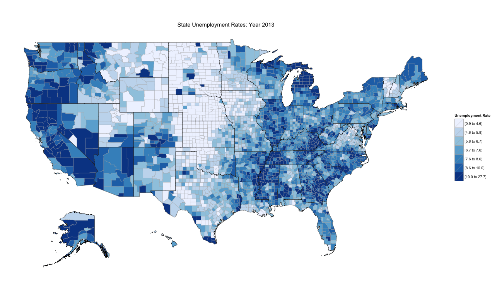

Developing Data Products - Choropleth Map of US Unemployment Rates
========================================================
author: Russ Boucher    
date: September 14 2015
transition: rotate

Overview

========================================================

This presentation describes an application created for the Developing Data Products course project that is part of the Coursera Data Science Specialization

The project has two parts:

- Create a **Shiny** application and deploy it on RStudio's servers 
- Use **Slidify** or **RStudio Presenter** to prepare a reproducible pitch presentation about the application

The Application
========================================================

A choropleth map is a thematic map with areas that are shaded in proportion to the levels of the variable displayed on the map. It provides an easy way to visualize the level of variability within a geographic region.

The application uses the `rUnemploymentData` and `choroplethrMaps` packages to create choropleth maps of US unemployment rates by county. Users can select a national or state map for any year between 1990 and 2013.

The application is available on the <a href = 'https://krashski.shinyapps.io/choropleth-ui-data'>Shinyapps.io</a> website 

Source code is available on <a href = 'https://github.com/krashski/Developing-Data-Products/tree/master/choropleth-ui-data'>GitHub</a>

The Data
========================================================
The data consist of annualized unemployment rates for 3,143 US counties for the years 1990-2013

```r
library(rUnemploymentData)
data(df_county_unemployment)

# show 2012-2013 data columns only
head(df_county_unemployment[, -c(4:25)], 5)
```

```
  region county.name state.name 2012 2013
1   1001     autauga    alabama  6.3  5.7
2   1003     baldwin    alabama  6.7  5.8
3   1005     barbour    alabama 11.0 10.0
4   1007        bibb    alabama  7.5  6.8
5   1009      blount    alabama  6.1  5.6
```
(Source: <a href = 'http://www.bls.gov/lau/'>US Bureau of Labor Statistics</a>)

Sample Map
========================================================
This map shows Year 2013 unemployment rates for all US counties

